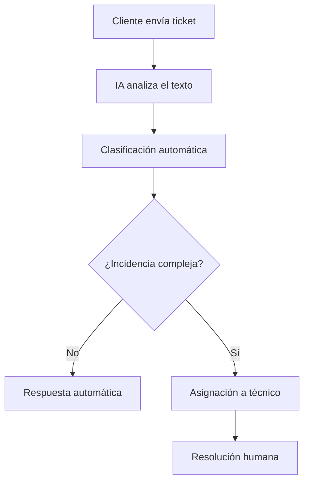

# Práctica IA (RA4 · a) — Automatización y optimización

## 1) Proceso elegido
- Nombre del proceso: Gestión de incidencias de soporte técnico
- Contexto (empresa/servicio web/IT): Empresa de servicios web que ofrece hosting y mantenimiento de sitios WordPress
- Rol/es implicados: Cliente | Técnico de soporte | Administrador de sistemas

## 2) ANTES (sin IA)
- Pasos (5–7):
  1. El cliente envía un ticket por email o formulario.
  2. El técnico lee manualmente el mensaje.
  3. Clasifica la incidencia (hosting, WordPress, seguridad, facturación).
  4. Prioriza el ticket según urgencia.
  5. Asigna el ticket a un técnico.
  6. El técnico investiga el problema.
  7. Responde al cliente.
- Tiempo aproximado por caso: 25–30 minutos.
- Problemas / cuellos de botella: Clasificación manual lenta | Errores de prioridad | Sobrecarga del equipo de soporte | Retrasos en la respuesta inicial.

## 3) DESPUÉS (con IA)
- ¿Qué automatiza la IA? Clasificación automática del ticket | Detección de urgencia y tipo de problema | Respuesta inicial automática con soluciones básicas.
- ¿Qué queda para humanos? Resolución de incidencias complejas | Validación de respuestas automáticas | Atención personalizada a clientes críticos.
- Datos necesarios (tipos de datos, sin datos personales):
- Modelo/técnica (NLP, clasificación, recomendación, visión, etc.):

## 4) Optimización (mejora medible)
Define 3 métricas con valores antes/después:
- Tiempo: 30 min/ticket -> 5 min/ticket
- Coste: Alto (muchas empleados) -> Medio–bajo
- Calidad: Variable -> Más consistente y rápida

## 5) Diagrama del flujo (ASCII o Mermaid)

## 6) Riesgos y mitigación
- Riesgo 1: Clasificación incorrecta del ticket.
  - Mitigación 1: Revisión humana y reentrenamiento del modelo.
- Riesgo 2: Respuestas automáticas inadecuadas.
  - Mitigación 2: Limitar la IA a respuestas de primer nivel y FAQs.

## 7) Fuente oficial
- Enlace: https://developers.openai.com/api/docs
