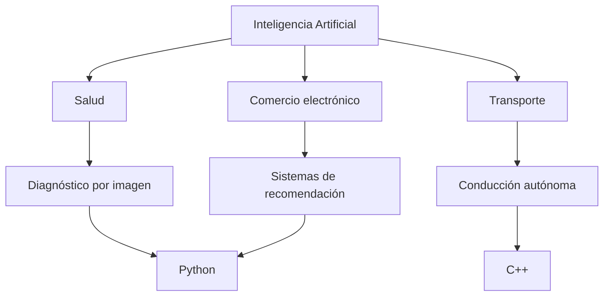

# 🤖 Práctica IA (RA4 · d+e)
## Sectores con implantación relevante y lenguajes de programación en IA

---

# 1. Introducción

## Objetivo de la práctica
El objetivo de esta práctica es identificar sectores donde la Inteligencia Artificial (IA) tiene una implantación relevante y analizar los lenguajes de programación más utilizados para desarrollar sistemas de IA.

## Relación con DAW/DAM
Para los desarrolladores web y de aplicaciones multiplataforma (DAW/DAM), conocer cómo se integra la IA en diferentes sectores permite crear aplicaciones más inteligentes, como sistemas de recomendación, chatbots, análisis de datos o automatización de procesos.

---

# 2. Sectores con implantación relevante de IA

## 🏥 Sector 1: Salud

**Tipo de empresa/servicio**

- Hospitales  
- Clínicas  
- Laboratorios médicos  
- Empresas de tecnología sanitaria  

**Aplicación de IA**

Diagnóstico asistido mediante análisis de imágenes médicas.

**Qué tarea mejora o automatiza**

- Análisis de radiografías
- Resonancias magnéticas
- Tomografías

Permite detectar enfermedades como cáncer o problemas neurológicos.

**Por qué la IA tiene implantación relevante**

La IA permite analizar grandes cantidades de datos médicos con mayor rapidez y precisión que los métodos tradicionales.

**Beneficios**

- Diagnósticos más rápidos  
- Reducción de errores médicos  
- Detección temprana de enfermedades  
- Apoyo a profesionales sanitarios  

---

## 🛒 Sector 2: Comercio electrónico

**Tipo de empresa/servicio**

- Tiendas online  
- Marketplaces  
- Plataformas de venta digital  

**Aplicación de IA**

Sistemas de recomendación de productos.

**Qué tarea mejora o automatiza**

La recomendación automática de productos según:

- historial de compras
- búsquedas
- comportamiento del usuario

**Por qué la IA tiene implantación relevante**

Las plataformas de comercio electrónico manejan enormes cantidades de datos de usuarios, lo que permite aplicar modelos de aprendizaje automático.

**Beneficios**

- Mejor experiencia del usuario  
- Aumento de ventas  
- Personalización de contenido  
- Marketing más eficiente  

---

## 🚗 Sector 3: Transporte y movilidad

**Tipo de empresa/servicio**

- Empresas de transporte  
- Empresas de logística  
- Desarrollo de vehículos autónomos  

**Aplicación de IA**

Conducción autónoma y optimización de rutas.

**Qué tarea mejora o automatiza**

- Conducción automática  
- Reconocimiento de señales de tráfico  
- Planificación de rutas eficientes  

**Por qué la IA tiene implantación relevante**

Los vehículos y sistemas de transporte utilizan sensores, cámaras y GPS que generan datos en tiempo real que la IA puede procesar.

**Beneficios**

- Reducción de accidentes  
- Transporte más eficiente  
- Menor consumo de combustible  
- Optimización logística  

---

# 3. Lenguajes de programación en IA

## 🐍 Python

**Uso principal en IA**

- Machine Learning  
- Deep Learning  
- Análisis de datos  

**Ventajas**

- Sintaxis sencilla  
- Gran comunidad  
- Muchas librerías especializadas  

**Ejemplos de uso**

- Sistemas de recomendación  
- Predicción de datos  
- Procesamiento de lenguaje natural  

---

## 📊 R

**Uso principal en IA**

- Análisis estadístico  
- Ciencia de datos  

**Ventajas**

- Potente análisis estadístico  
- Excelente visualización de datos  
- Muy usado en investigación  

**Ejemplos de uso**

- Modelos predictivos  
- Análisis de datos  
- Visualización de resultados  

---

## ☕ Java

**Uso principal en IA**

Aplicaciones empresariales con IA integrada.

**Ventajas**

- Alto rendimiento  
- Escalable  
- Integración sencilla con sistemas empresariales  

**Ejemplos de uso**

- Sistemas de recomendación  
- Plataformas financieras  
- Sistemas de análisis de datos  

---

## ⚙️ C++

**Uso principal en IA**

Sistemas de alto rendimiento y tiempo real.

**Ventajas**

- Muy rápido  
- Control del hardware  
- Alta eficiencia  

**Ejemplos de uso**

- Robótica  
- Visión artificial  
- Vehículos autónomos  

---

# 4. Relación entre sectores, tipo de IA y lenguaje

| Sector | Aplicación de IA | Tipo de IA | Lenguaje recomendado | Justificación |
|------|------|------|------|------|
| Salud | Diagnóstico por imagen | Deep Learning / Visión artificial | Python | Librerías especializadas para análisis de imágenes |
| Comercio electrónico | Recomendación de productos | Machine Learning | Python | Facilita el análisis de grandes datos de usuarios |
| Transporte | Conducción autónoma | Visión artificial / Deep Learning | C++ | Alto rendimiento para sistemas en tiempo real |

---

# 5. Diagrama

---

# 6. Riesgos y mitigación

## Riesgo 1
Uso incorrecto de datos personales o problemas de privacidad.

**Mitigación**

- Aplicar normativas de protección de datos  
- Anonimizar la información  

---

## Riesgo 2
Dependencia excesiva de sistemas automatizados.

**Mitigación**

- Supervisión humana  
- Auditorías periódicas de los sistemas de IA

---

# 7. Conclusión

**Sectores que destacan**

Los sectores de salud, comercio electrónico y transporte destacan por la gran cantidad de datos que manejan y por el impacto positivo que la IA tiene en eficiencia y precisión.

**Lenguajes más utilizados**

Python aparece como el lenguaje más utilizado en inteligencia artificial debido a su facilidad de uso y su amplio ecosistema de librerías.

**Importancia para DAW/DAM**

Para los desarrolladores web y de aplicaciones, conocer estas tecnologías permite integrar funciones inteligentes como:

- análisis de datos
- automatización
- sistemas de recomendación
- asistentes virtuales
